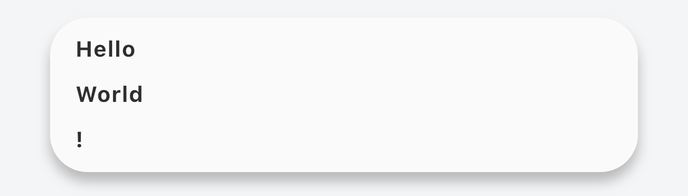

# zenith_snack_bar

The ZenithSnackBar is located at the top of the screen and can display multiple contents at the same time.



## Usage

```dart
class MyApp extends StatefulWidget {
  const MyApp({super.key});

  @override
  State<MyApp> createState() => _MyAppState();
}

class _MyAppState extends State<MyApp> {
  late ZenithSnackBarController controller;

  @override
  void initState() {
    super.initState();
    controller = ZenithSnackBarController();
  }

  @override
  void dispose() {
    controller.dispose();
    super.dispose();
  }

  @override
  Widget build(BuildContext context) {
    return MaterialApp(
      home: ZenithSnackBarScope(
        controller: controller,
        child: Home(),
      ),
    );
  }
}
```
To add content, use `ZenithSnackBarScope.of(context).add()`.

```dart
ZenithSnackBarScope.of(context).add(
  context: context,
  content: ZenithSnackBarTile(
    key: Key('key'),
    priority: 1,
    // If you want to dismiss content automatically, set duration.
    // duration: Duration(seconds: 3),
    child: Text('Hello'),
  ),
);
```

To remove content, use `ZenithSnackBarScope.of(context).remove()`. Users can remove content by swiping it to the left or right.

```dart
ZenithSnackBarScope.of(context).remove(Key('key'));
```

Use `ZenithSnackBarScope.of(context).dismiss()` to dismiss the SnackBar itself. Users can dismiss it by swiping it up.

```dart
ZenithSnackBarScope.of(context).dismiss();
```
